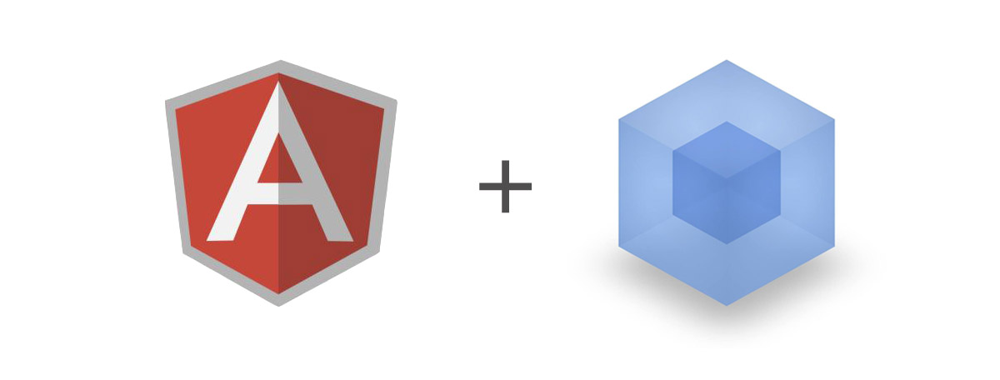

### 介绍
一款基于`webpack`的快速构建`angular1`的多页应用构建方案

#### 初衷

`angular-m-cli`起源于开发`angular1`的中后台项目。在如今的前端时代，使用`es5`以及`script`标签引入的方式开发大型应用明显会降低开发效率，因而`工程化`思想便引入进来。已有的`vue-cli`、`create-react-app`、`angular-cli`均针对于各自的框架，对`angular1`并不友好，并且面对多页应用，用户仍然需要手动做很多事情。

#### 产出
基于以上因素，一个针对`angular1`的`webpack.config.js`的构建方案诞生 —— [angular-custom-cli](https://github.com/mescalchuan/angular-custom-cli.git)。并且，为了提高多页应用的开发速度，基于`commander`和`co-prompt`将其封装成脚手架工具`angular-m-cli`，真正做到了`angular1`的多页应用工程化构建方案。

#### 使用 angular-m-cli，您可以做到
* 快速构建项目原型
* 自动生成新页面并完成相关配置（包括入口文件、`css`、`index.html`）
* 利用本地服务器完成开发
* 使用`mock`进行接口测试，实现前后端分离
* 一键删除指定页面和相关配置
* 一键打包

#### 核心技术
* `co` 自动执行`Generator`
* `co-prompt` co的命令行实现，同步获取用户输入
* `commander` 命令行创建与解析的工具
* `download-git-repo` github源码下载
* `ejs` 模板渲染