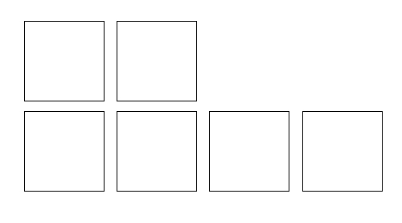
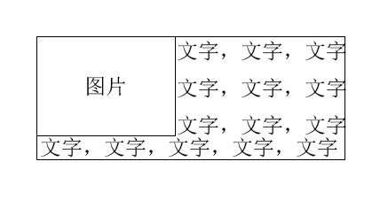
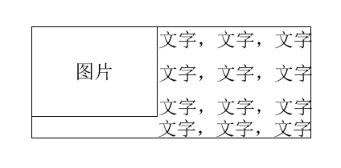
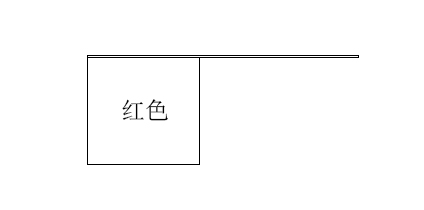
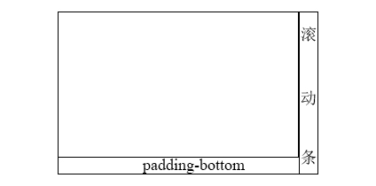
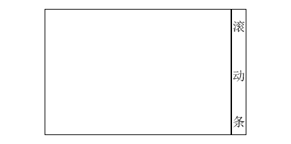

# 流的破坏与保护

### float
块状化的意思是：元素一旦float值不为none，则其display计算值就自动变成了block，不管你之前是内联还是块级。

两侧定宽，中间自适应：
```css
.left { float: left; width: 70px; }
.right { float: right; width: 70px; }
.container {
	margin: 0 70px;
}
```

### clear
clear的意思是：设置了clear属性的元素自身如何如何，而不是让float元素如何如何。
* none： 默认值，左右浮动来就来
* left：左侧抗浮动
* right：右侧抗浮动
* both：两侧抗浮动

```css
li { width=height=20px; float: left; }
li:nth-child(3) { clear: both; }
```


你可能好奇为什么不是三行？
clear属性是让自身不能和前面的浮动元素相邻，也就是说后面的浮动元素它是不管的。更进一步讲，float为left时，clear: left有效float为right时，clear: right有效。其实，float为left时，both等同于left，float为right时，both等同于right。

clear属性只有块级元素才有效。而伪元素默认都是内联，这就是平时借助伪元素清除浮动时需要设置display的原因：
```css
.clear:after {
	content: '',
    display: table\block\list-item;
    clear: both;
}
```

### BFC（！！！）
BFC全称为块级格式化上下文。如果一个元素是BFC，那么它的内部元素再怎么折腾都不会影响外部元素（比如absolute，再怎么折腾，会影响外层元素吗？不会！）。所以，BFC元素是不可能发生margin重叠的，因为margin重叠是会影响外部元素的。BFC元素也可以用来清除浮动，因为如果不清除，子元素浮动会导致父元素高度塌陷，必然影响后面元素的布局和定位。

如何BFC？（满足一个即可）
* html根元素
* float值不为none
* overflow值为hidden（常用）
* display值为table-cell或inline-block（常用）
* position为absolute或fixed

具有BFC特性的元素的子元素不会受外部元素影响，也不会影响外部元素。

举个例子：
```html
<div>
	
    <p>文字</p>
</div>

img { float: left; }
```


float为left后影响了原有的布局。
我们为p设置`overflow: hidden`让p变成BFC（子元素也就是文本不会受外部元素float: left影响）。



再举个例子：
```css
<div class="father">
	<div class="child"></div>
</div>

.father { border: 1px solid black; }
.child { 
	float: left; 
    width=height=100px; 
    background-color: red; 
}
```



可以看到，float影响了father的布局。我们为father设置`overflow: hidden`，效果如下：


table-cell的特性：不管你给他设置多么大的宽，它都不会超过父级的宽。

### overflow
当子元素内容超过容器高度限制的时候，裁剪的边界是`border box`，而非`padding box`。

在chrome浏览器下，如果容器可滚动，则padding-bottom也算在滚动尺寸之内，ie和firefox会忽略padding-bottom。

当滚动到底部时，chrome的效果：



ie和firefox的效果：



浏览器的差异会导致scrollHeight和其他值不一样，因此，不要在滚动容器中设置padding-bottom，而是在最底部的子元素上设置margin-bottom。


在pc端，窗体滚动高度可以使用`document.documentElement.scrollTop`获取，在移动端可以使用`document.body.scrollTop`获取。

> 文字溢出时的点点点效果：
```css
.ell {
	text-overflow: ellipsis;
    white-space: nowrap;
    overflow: hidden;
}
```

锚点定位的两种方法：
* id
* a标签的href

```html
<div id="here"></div>
<a name="there"></a>

<a href="#here">toHere</a>
<a href="#there">toThere</a>
```

在滚动元素上设置overflow: hidden，你会看见内容被裁剪了，滚动条也不见了。其实，内容并没有被裁剪，滚动条也仅仅是隐藏了，鼠标无法滚动了而已。不信你用js更改滚动条的滚动距离或者锚点定位一下，你会发现和overflow: auto\scroll没区别。

### absolute
绝对定位的宽与高均是针对参照物定位的。

正常流的width100%和height100%参考自father的`content box`，absolute则参考自参照物的`padding box`。absolute的top\right\bottom\left无视参照物的padding，始终从padding外侧开始定位。absolute的margin和trbl是可以共存的，效果是二者之和。trbl的百分比同width和height，参照的是参照物的`padding box`，你就这么认为吧，绝对定位的所有百分比均参考的是参照物的`padding box`。

如果只设置了absolute而没有指定trbl中的任何一个，那么元素的布局与正常流没区别，唯一的区别就是它不占据空间了。举个例子：


absolute的定位（不使用trbl）则不需要父元素设置为relative，当然，如果你设置的值是百分比就需要指定父元素为relative，否则它会一直向上寻找直到找到参照物并参考它的`padding box`作为百分比的值。

> 父级的text-align会影响absolute（不管absolute的元素是内联还是块级），因此用它实现水平居中：
```css
.father {
	text-align: center;
}
.child {
	display: inline-block;
    position: absolute;
    width=height=100px;
    margin-left: -50px;
}
//原理：inline-block会在child前面产生幽灵空白节点，text-align: center使得幽灵空白节点居中于father。而child为absolute使其表现为无依赖的绝对定位，最终位于幽灵空白节点的后面。然后我们再使用margin-left调整位置。

//兼容edge浏览器
.father:before { content: ''; }
```

### absolute与overflow

以下几种情况，overflow不会裁剪：
```html
<div style="overflow: hidden;">
	
</div>
//子元素设置了absolute，不裁剪
```

```html
<div style="position: relative;">
	<div style="overflow: hidden;">
        
    </div>
</div>
//overflow的父级元素是定位元素，不裁剪
```

```html
<div style="overflow: hidden; position: relative;">
	
</div>
//overflow本身也是定位，裁剪，请与1做对比
```

```html
<div style="overflow: hidden;">
	<div style="position: relative;">
        
    </div>
</div>
//overflow和定位元素之间还有一个定位元素，裁剪。请与2做对比
```

如果overflow的属性值不是hidden，那么即使绝对定位元素高度比overflow元素高度还要大，也不会出现滚动条。

除了以上之外，当遇到absolute元素被裁剪或者fiexd固定定位失效时，看看定位元素的子元素是不是设置了transform。

### absolute的流体特性
当设置了trbl后，绝对定位才真正变成绝对定位元素。

绝对定位的height百分比直接参考参照物的`padding box`垂直方向，不需要从html、body开始一层层设置height。

### relative
相对定位设置trbl是相对于自身进行偏移的，有点像margin，但不会影响后面元素的布局。

```html
//文字不动，只是div上移100
<div relative top-100></div>
<p>123</p>

//文字跟着div一起上移100
<div margin-top-100></div>
<p>123</p>
```

相对定位中，一切百分比均参考自父级的`content box`，注意是父级，而不是参照物。对于relative来说，参照物就是父级。垂直方向参考自父级的height。

与absolute不同，当relative的设置了对立方向（top-bottom、left-right）时，根据文档流的方向保留，比如，正常文档流下设置同时设置了trbl，只有tl生效。

定位元素的层级大于正常元素。

### fixed
fixed元素的参照物是根元素html。

我们往往使用fixed实现全屏模态框（将遮罩层设为fixed），但你会发现当模态框内容溢出时你去滚动它，正常文档也会跟着滚动没有锁定。如果是移动端项目，阻止touchmove事件的默认行为可以防止滚动；如果是pc端项目，直接让根元素overflow: hidden即可。