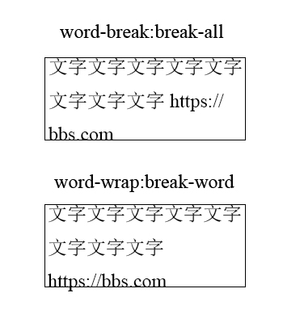

# 文本处理

### font-size
浏览器默认font-size是16px。

em相对于当前元素（也就是当前元素的font-size大小），rem相对于根元素。

ie9及以上才支持rem。

现代网页设计最佳实践：
* 即使是定宽的传统桌面网页，也要做响应式，尤其是以1200px为设计的网页，要响应到800px。
* 如果因各种原因无法响应式，也没有必要全局都用em或rem，只需要在以图文内容为主的重要布局区域使用可缩放的font-size处理即可。比如小说的阅读页、文章区域、私信对话内容、评论区等，这些都建议使用em、rem、百分比。


### 文本控制
 word-break：
 * normal：使用默认换行规则
 * break-all：允许任意非中日韩文文本间的单词断行
 * keep-all：行为上与normal一致

word-wrap：
* normal：正常的换行规则
* break-word：一行单词中实在没有其他靠谱的换行点的时候换行



`word-break: break-all`就是所有的都换行，毫不留情；`word-wrap: break-word`则是如果有空格或中日韩文之类的就断它们，就不打英文的主意了。

white-space设置为nowrap时，元素的宽度表现为最大可用宽度，换行符和空格全部合并，文本尽可能一行显示。

text-transform控制字符大小写
```css
//适用于身份证输入（自动将x转换为X）和验证码输入
input {  
	text-transform: uppercase;
}
```

### ::first-letter和::first-line伪元素

两者必须是inline-block\block\table-cell才有效

::是伪元素，:是伪类，然而你大多看到的是:before\:first-letter等而不是::before\::first-letter，这是为了兼容ie8。

::first-letter实际应用举例
```css
<p>$99.99</p>
//$有特殊样子
.price:first-letter {
	margin-right: 5px;
    font-size: 30px;
    color: red;
}
```

