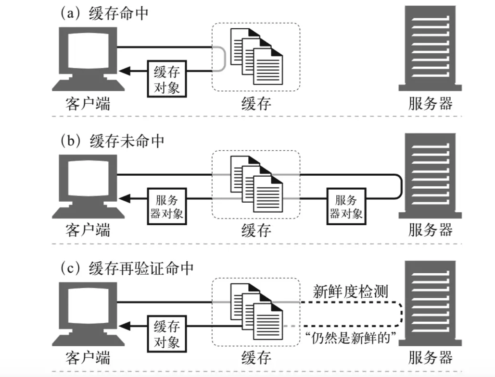

# 缓存

* 缓存可以减少冗余的数据传输，节省网络费用。
* 缓存缓解了网络瓶颈的问题。不需要更多的带宽就能够更快地加载页面。
* 缓存降低了对原始服务器的要求。服务器可以更快地响应，避免过载的出现。

缓存无法保存每份文档的副本 ，可以用已有的副本为某些到达缓存的请求提供服务。这被称为缓存命中(cache hit)，其他一些到达缓存的请求可能会由于没有副本可用，而被转发给原始服务器。这被称为缓存未命中(cache miss) 。如下所示：



### 缓存步骤

#### 1. 接收------缓存从网络中读取抵达的请求报文

缓存检测到一条网络连接上的活动，读取输入数据。

#### 2. 解析------缓存对报文进行解析，提取出 URL 和各种首部

接下来，缓存将请求报文解析为片断，将首部的各个部分放入易于操作的数据结构中。这样，缓存软件就更容易处理首部字段并修改它们了 。

#### 3. 查询------缓存查看是否有本地副本可用，如果没有，就获取一份副本(并将其保存在本地) 

在第三步中，缓存获取了 URL，查找本地副本。本地副本可能存储在内存、本地磁盘，甚至附近的另一台计算机中。如果本地没有这个文档，根据情形和配置，到原始服务器或父代理中去取，或者返回一条错误信息。

已缓存对象中包含了服务器响应主体和原始服务器响应首部，这样就会在缓存命中时返回正确的服务器首部。已缓存对象中还包含了一些元数据(metadata)，用来记录对象在缓存中停留了多长时间，以及它被用过多少次等 。

#### 4. 新鲜度检测------缓存查看已缓存副本是否足够新鲜，如果不是，就询问服务器是否有任何更新 

HTTP 通过缓存将服务器文档的副本保留一段时间。在这段时间里，都认为文档是“新鲜的”，缓存可以在不联系服务器的情况下，直接提供该文档。但一旦已缓存副本停留的时间太长，超过了文档的新鲜度限值(freshness limit)，就认为对象“过时”了，在提供该文档之前，缓存要再次与服务器进行确认，以查看文档是否发生了变化。客户端发送给缓存的所有请求首部自身都可以强制缓存进行再验证，或者完全避免验证。

#### 5. 创建响应------缓存会用新的首部和已缓存的主体来构建一条响应报文

我们希望缓存的响应看起来就像来自原始服务器的一样，缓存将已缓存的服务器响应首部作为响应首部的起点。然后缓存对这些基础首部进行了修改和扩充。

缓存负责对这些首部进行改造，以便与客户端的要求相匹配。比如，服务器返回的可能是一条 HTTP/1.0 响应(甚至是 HTTP/0.9 响应)，而客户端期待的是一条HTTP/1.1 响应，在这种情况下，缓存必须对首部进行相应的转换。缓存还会向其中插入新鲜度信息(Cache-Control、Age 以及 Expires 首部)，而且通常会包含一个 Via 首部来说明请求是由一个代理缓存提供的。

#### 6. 发送------缓存通过网络将响应发回给客户端 

一旦响应首部准备好了，缓存就将响应回送给客户端。和所有代理服务器一样，代理缓存要管理与客户端之间的连接。

### 强缓存

通过特殊的 HTTP Cache-Control 首部和 Expires 首部，HTTP 让原始服务器向每个文档附加了一个“过期日期”。这些首部说明了在多长时间内可以将这些内容视为新鲜的。 


服务器用 HTTP/1.0+ 的 Expires 首部或 HTTP/1.1 的 Cache-Control: max-age 响应首部来指定过期日期，同时还会带有响应主体。Expires 首部和 Cache-Control:max-age 首部所做的事情本质上是一样的，但由于 Cache-Control 首部使用的是相对时间而不是绝对日期，所以我们更倾向于使用比较新的 Cache-Control 首部。绝对日期依赖于计算机时钟的正确设置。 

> cache-control 优先级更高

#### Cache-Control：no-store

禁止一切缓存（这个才是响应不被缓存的意思）。缓存通常会像非缓存代理服务器一样，向客户端转发一条 no-store 响应，然后删除对象。 

#### Cache-Control：no-cache

强制客户端直接向服务器发送请求,也就是说每次请求都必须向服务器发送。服务器接收到请求，然后判断资源是否变更，是则返回新内容，否则返回304，未变更。这个很容易让人产生误解，使人误以为是响应不被缓存。实际上Cache-Control: no-cache是会被缓存的，只不过每次在向客户端（浏览器）提供响应数据时，缓存都要向服务器评估缓存响应的有效性。

#### 服务器再验证

仅仅是已缓存文档过期了并不意味着它和原始服务器上目前处于活跃状态的文档有实际的区别;这只是意味着到了要进行核对的时间了。这种情况被称为“服务器再 验证”，说明缓存需要询问原始服务器文档是否发生了变化。 

* 如果再验证显示内容发生了变化，缓存会获取一份新的文档副本，并将其存储在旧文档的位置上，然后将文档发送给客户端。

* 如果再验证显示内容没有发生变化，缓存只需要获取新的首部，包括一个新的过期日期，并对缓存中的首部进行更新就行了。 

#### Meta

HTML 2.0 定义了 `<META HTTP-EQUIV>` 标签。这个可选的标签位于 HTML 文档的顶部，定义了应该与文档有所关联的 HTTP 首部。

```html
<META HTTP-EQUIV="Cache-control" CONTENT="no-cache"/>
```

不幸的是，支持这个可选特性会增加服务器的额外负载，这些值也只是静态的，而 且它只支持 HTML，不支持很多其他的文件类型，所以很少有 Web 服务器和代理支 持此特性。 

### 协商缓存

#### If-Modified-Since:Date再验证 

如果从指定日期之后文档被修改过了，就执行请求的方法。可以与 Last-Modified 服务器响应首部配合使用，只有在内容被修改后与已缓存版本有所不同的时候才去获取内容。

#### If-None-Match：etag

服务器可以为文档提供特殊的标签，而不是将其与最近修改日期相匹配，这些标签就像序列号一样。如果已缓存标签与服务器文档中的标签有所不同，If-None-Match 首部就会执行所请求的方法。

 

 
