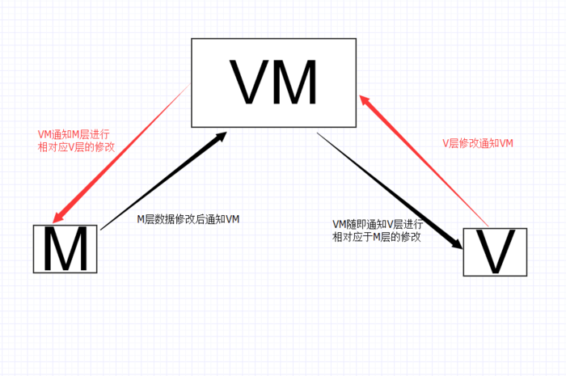
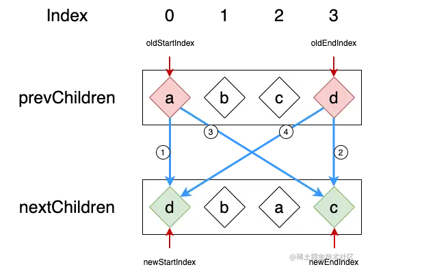
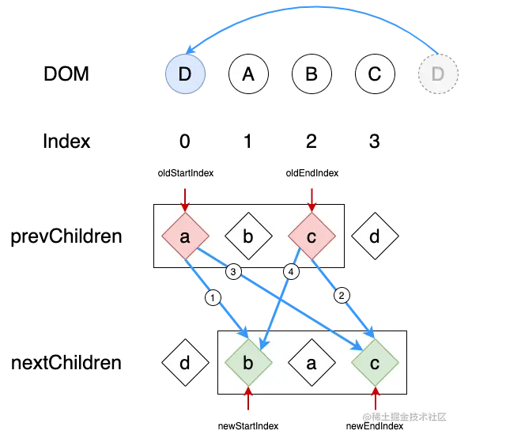
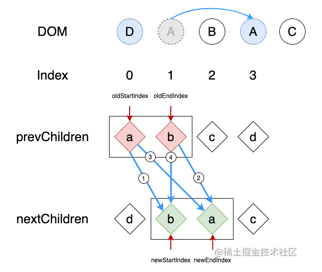
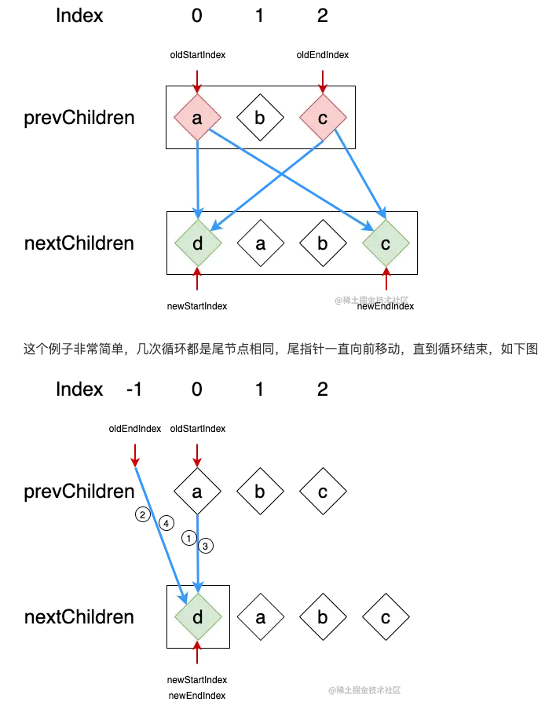
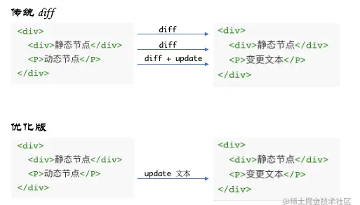

# Vue

## 基础

### 命令式和声明式

* 命令式：关注过程，代码本身描述的是“做事的过程”，如 jQuery，代价是要维护整个过程
* 声明式：关注结果，将过程封装，代码本身产出的是“做事的结果”，如 Vue，虽然性能 >= 命令式，却减少了维护过程的成本

Vue 的内部实现是命令式的，而暴露给用户的是声明式

### 性能

* 命令式代码的更新性能消耗：直接修改的性能消耗
* 声明式代码的更新性能消耗：找出差异的性能消耗 + 直接修改的性能消耗

声明式代码的性能不优于命令式代码的性能

### 虚拟 DOM

Vue 在保持可维护性的同时让性能损失最小化

假设使用 innerHTML 替换整个 app 元素：
* innerHTML：重新构建 HTML 字符串，再重新设置 DOM 元素的 innerHTML 属性，相当于销毁所有旧的 DOM 元素，再全量创建新的 DOM 元素
* 虚拟 DOM：重新创建 js 对象（虚拟 DOM 树），比较新旧虚拟 DOM，找到变化的元素更新，得益于 js 的计算性能小于 DOM 计算性能
* 原生 js：直接更新要改变的 DOM，性能最高，代价是需要自己维护整个找出「要改变的 DOM」的过程

### 运行时和编译时

* 运行时 Render：将数据结构转换为 DOM 元素，`{ type: 'div', prop: {}, children: [] } => div(DOM)`，无法分析用户提供的内容
* 编译时 Compiler：将 HTML 标签直接编译成 DOM 元素，`div(template) => div(DOM)`，可以分析用户提供的内容，但不够灵活，必须编译后才能用
* 运行时 + 编译时：先将 HTML 编译成数据结构，再转换为 DOM 元素，`div(template) => { type: 'div', prop: {}, children: [] } => div(DOM)`，保持了灵活性和可分析性

## 响应式

### mvvm


viewModel是整个vue实例

vue在编译阶段会识别出所有绑定在元素（通过 el 属性传入）上的指令。
link 过程中，建立这些指令与对应数据（通过 data 属性传入初始值）的watcher。watcher会在dep上添加订阅者，observe用来监听所有属性的变化，告知dep，由dep分发给每个watcher，再由watcher更新view。

双向绑定：数据劫持加收发订阅模式

数据劫持：defineProperty
```js
//数据劫持
function defineReactive (obj, key, val) {
	var dep = new Dep();
    Object.defineProperty(obj, key, {
    	get: function() {
         //添加订阅者watcher到主题对象Dep
         if(需要添加订阅者) {
         // JS的浏览器单线程特性，保证这个全局变量在同一时间内，只会有同一个监听器使用
         	dep.addSub(watcher);
         }
         return val;
       },
       set: function (newVal) {
       if(newVal === val) return;
       	val = newVal;
        console.log(val);
        // 作为发布者发出通知
        dep.notify();
       }
     })
}
//observe
function observe(this.data) {
 	Object.keys(obj).forEach(function(key) {
    	defineReactive(this.data, key, this.data[key]);
    })
}
//dep负责发送通知
function Dep() {
	this.subs = [];
}
Dep.prototype = {
	addSub: function(sub) {
    	this.subs.push(sub);
	},
   	notify: function() {
        this.subs.forEach(function(sub) {
          	sub.update();
        })
    }
}
```

### 数组检测
数组考虑性能原因没有用 defineProperty 对数组的每一项进行拦截，而是选择对 7 种数组（push,shift,pop,splice,unshift,sort,reverse）方法进行重写（更改数组的原型，通知视图更新）。
所以在 Vue 中修改数组的索引和长度是无法监控到的。需要通过以上 7 种变异方法修改数组才会触发数组对应的 watcher 进行更新。
除了 7 种以外的方法修改数组，无法监控，需要用到 $set：利用 defineReactive 方法重新创建响应式。

## 渲染机制

### 模板编译原理
* 1、将模板字符串 转换成 element ASTs（解析器）
* 2、对 AST 进行静态节点标记，主要用来做虚拟DOM的渲染优化（优化器）
* 3、使用 element ASTs 生成 render 函数代码字符串（代码生成器）

### 异步更新
Vue 是组件级更新，如果不采用异步更新，那么每次更新数据都会对当前组件进行重新渲染，所以为了性能， Vue 会在本轮数据更新后，在异步更新视图。核心思想 nextTick 。
dep.notify() 通知 watcher进行更新， subs[i].update 依次调用 watcher 的 update ， queueWatcher 将 watcher 去重放入队列， nextTick(flushSchedulerQueue) 在下一 tick 中刷新 watcher 队列（异步）。
### NextTick
* 1、把回调函数放入 callbacks（利用闭包）等待执行
* 2、将执行函数放到微任务或者宏任务中（分别尝试使用原生的 Promise.then/MutationObserver 监听 DOM 结构变化/setImmediate 将任务放入事件循环的 check 阶段/setTimeout）
* 3、事件循环到了微任务或者宏任务，执行函数依次执行 callbacks 中的回调

### 虚拟 DOM
编译阶段，将模板转换成 AST 树，用 JS 对象（虚拟 DOM）来描述 DOM 结构。

## DIFF 算法

### Vue2 双端比较
新列表和旧列表两个列表的头与尾互相对比，，在对比的过程中指针会逐渐向内靠拢，直到某一个列表的节点全部遍历过，对比停止。

* 使用旧列表的头一个节点 oldStartNode 与新列表的头一个节点 newStartNode 对比
* 使用旧列表的最后一个节点 oldEndNode 与新列表的最后一个节点 newEndNode 对比
* 使用旧列表的头一个节点 oldStartNode 与新列表的最后一个节点 newEndNode 对比
* 使用旧列表的最后一个节点 oldEndNode 与新列表的头一个节点 newStartNode 对比



* 当旧列表的头一个节点 oldStartNode 与新列表的头一个节点 newStartNode 对比时 key 相同。那么旧列表的头指针 oldStartIndex 与新列表的头指针 newStartIndex 同时向后移动一位。
* 当旧列表的最后一个节点 oldEndNode 与新列表的最后一个节点 newEndNode 对比时 key 相同。那么旧列表的尾指针 oldEndIndex 与新列表的尾指针 newEndIndex 同时向前移动一位。
* 当旧列表的头一个节点 oldStartNode 与新列表的最后一个节点 newEndNode 对比时 key 相同。那么旧列表的头指针 oldStartIndex 向后移动一位；新列表的尾指针 newEndIndex 向前移动一位。
* 当旧列表的最后一个节点 oldEndNode 与新列表的头一个节点 newStartNode 对比时 key 相同。那么旧列表的尾指针 oldEndIndex 向前移动一位；新列表的头指针 newStartIndex 向后移动一位。

遍历到步骤 4，发现 key 相同（d），old 前移，new 后移： 



遍历到步骤 2，发现 key 相同（c），old 与 new 均前移：



遍历到步骤 3，发现 key 相同（a），old 后移，new 前移： 

最后只剩下 old b 与 new b 对比。

#### 以插入节点为例再看下双端算法




### Vue3 最长递增子序列

基于贪心 + 二分查找需要移动的 DOM 节点。并且通过拷贝一个数组，用来存储正确的结果，然后通过回溯赋值的方式解决了贪心 + 二分查找替换方式可能造成的值不正确的问题。

### VFor 中 key 的作用
在创建 vnode 阶段，就将这些动态节点给标记和提取出来，如果要更新，就只更新这些动态节点，静态节点保持不变（相当于普通的虚拟节点加了个 dynamicChildren 属性，能够收集节点本身和它所有子节点中的动态节点）。



## VueRouter
* 1、hash 模式：监听 hashchange 事件
* 2、history 模式：利用 html5 的 pushState、popState、replaceState API，改变 url 地址且不会发送请求。

### 钩子函数
```js
全局
router.beforeEach((to, from, next) //跳转前
router.afterEach //跳转后
组件内
beforeRouteEnter
beforeRouteUpdate (2.2 新增)
beforeRouteLeave
路由配置里
beforeEnter
```

执行顺序：
* 1、在失活的组件里调用 beforeRouteLeave 守卫
* 2、调用全局的 beforeEach 守卫
* 3、在重用的组件里调用 beforeRouteUpdate 守卫 (2.2+)
* 4、在路由配置里调用 beforeEnter
* 5、在被激活的组件里调用 beforeRouteEnter
* 6、调用全局的 beforeResolve 守卫 (2.5+)
* 7、调用全局的 afterEach 钩子

## Vuex
Vuex 整体思想诞生于 flux，其中的 store 本质就是没有 template 的隐藏着的 vue 组件。
* 1、本质是一个对象
* 2、对象有两个属性，一个是 install 方法，一个是 Store 这个类
* 3、Install 方法的作用是将 store 这个实例挂载到所有的组件上
* 4、Store 这个类拥有 commit，dispatch 这些方法，Store 类里将用户传入的 state 包装成 data，作为 new Vue 的参数，从而实现了 state 值的响应式。

## 其他
### Computed 是如何做到数据缓存的
通过 dirty 标志位判断是否需要更新，若需要更新，则运行计算 wacher，否则直接运行渲染 wacher。

### 指令
指令：v-if、v-show、v-for、v-bind、v-on、v-model

自定义指令：
```js
Vue.directive(name, {
	//binding包括name\value\expression\arg等
	bind(el, binding, vnode) {指令第一次绑定到元素时}
    inserted(e, b, v) {被绑定元素插入父节点时调用}
    update(e, b, v) {所在组件的 VNode 更新时调用}
    等等
})

export default {
	name:'',
    directives: {
    	name: {
        	bind() {}
            xxx
        }
    }
}
```

### KeepAlive

采用 LRU 算法（Least Recently Used）

* 1、获取包裹的第一个子组件和组件名（如果存在多个子元素，则获取第一个子元素的 VNode）
* 2、根据 include、exclude 的设置进行条件匹配，决定是否缓存，不匹配则直接返回组件实例
* 3、根据组件 ID + tag 生成缓存 key，在缓存对象中查找是否已缓存过该组件实例，若存在，取出并更新 key 在缓存中的位置（数组下标），更新位置则采用 LRU
* 4、如果不存在，则在缓存对象中存储该实例并保存 key 值，之后检查缓存的实例数量是否超过 max 值，超过则根据 LRU 删除最久没用的实例（下标为 0）

