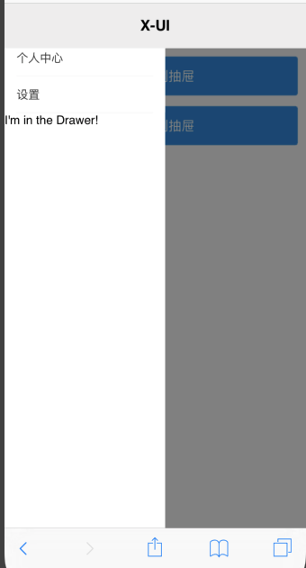
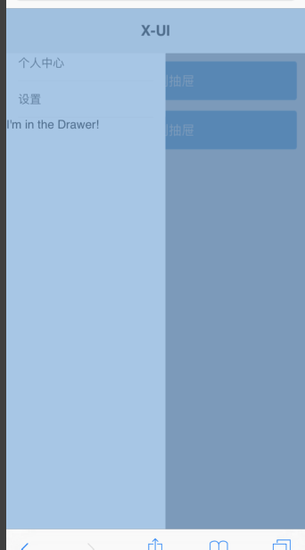
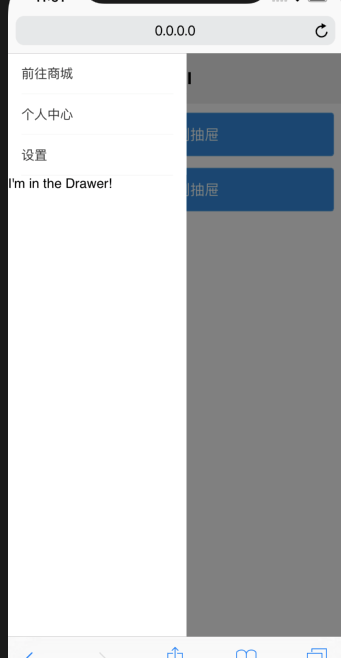

# H5 的坑

* [ios] input框的placeholder在真机中并没有垂直居中，而是靠上一点（chrome模拟器没有），但是输入内容后就是垂直居中了。解决方法是为input设置height=line-height
<br/>
* [ios] input框在真机中默认有2px的border边框（chrome模拟器没有）
<br/>
* [ios] input框 type=number无效，依旧调起的是正常键盘，即使设置了pattern为0-9也不行。若想实现数字键盘，需要将type=tel，如果只允许输入数字，还需要在tel的基础上监听input事件，将非数字内容替换掉。
<br/>
* fixed默认是相对于body定位的，比如fiexd，topleft0，元素会出现在屏幕左上角。  但是，translate会影响fiexd，比如：一个father里面的child是fixed，topleft0，然后我给father设置translateY(-50%)，（假设屏幕高1000，father高400，father垂直居中于屏幕。），最后的结果是 child出现在离屏幕上方300的位置，也就是说，原本左上角的child随着father一起移动了translateY(-50%)。 所以说，使用translate时，要保证其内部的所有元素没有用到absolute、fixed布局，否则会影响它们。
<br/>
* [ios] 滚动条弹动bug：  
    固定在顶部  
    中间内容带滚动条  
    固定在底部  
    如果content设置了固定高度，比如100%-top-bottom，那么在ios上滚动时有可能bottom和content会粘在一起  
  解决方案一：中间内容不设置固定高度，或者只设置min-height，内容自适应即可  
  解决方案二：中间内容设置为flex：1（尚未验证）  

 ```css
/\*修正\*/  
  
固定在顶部  
中间内容带滚动条  
固定在底部  
  
  
#header{  
  width: 100%;  
  height: 50px;  
  background-color: red;  
  position: fixed;  
  top: 0;  
}  
#footer{  
  width: 100%;  
  height: 50px;  
  background-color: red;  
  position: fixed;  
  bottom: 0;  
}  
#content {  
  margin: 50px 0;  
}  
body {  
  -webkit-overflow-scrolling:touch  
}  
!!content不设置高度，内容自己撑开
```

<br/>

* ie下a.style=str无效，需要改为a.setAttribute("style", str)

<br/>

* 虚拟dom和dom的区别：

    [https://www.zhihu.com/question/31809713?sort=created](https://www.zhihu.com/question/31809713?sort=created)

<br/>

* 弹出层出现后阻止外层滚动：

```css
外层：{  
position:fixed; top: 0px; right:0px; bottom:0px;  
z-index: 1002; left: 0px;  
}  
  
body:{overflow: 'hidden'}  
  
  
left:0;top:0;right：0；bottom：0；posioton:fixed;  
或者  
left:0;top:0;width:100%;height:100%；position:fixed
```

```css
  
1.弹框出现时给滚动条元素设置overflow：hidden，关闭后再设置回visible（默认值）  
2.出现时将长内容元素自身设置fixed，关闭后再恢复成static
```
<br/>

* 相机：
在ios上直接打开相机，在安卓上可以选择图片或打开相机  
  
在ios上可以选择图片或打开相机，在安卓上没有相机选项  

需要做平台监测  

[http://www.jb51.net/article/116694.htm](http://www.jb51.net/article/116694.htm)  

[https://segmentfault.com/q/1010000005768036](https://segmentfault.com/q/1010000005768036)  

[https://www.cnblogs.com/xianxianxxx/p/7851148.html](https://www.cnblogs.com/xianxianxxx/p/7851148.html)  

在红米上，直接打开相册了  
需要对红米单独监测：userAgent里有没有Redmi字段

<br/>

* 图片压缩：[https://www.cnblogs.com/007sx/p/7583202.html](https://www.cnblogs.com/007sx/p/7583202.html)

<br/> 

* 点击事件在ios和安卓上的兼容性bug：[http://blog.csdn.net/u014168594/article/details/77586539](http://blog.csdn.net/u014168594/article/details/77586539)

* [ios] safari 100vh后出现滚动条：设置一个全屏高的容器，使用100vh的话，在safari上会出现滚动条，原因是在safari上100vh不包含浏览器下方的「工具栏」，因此最终计算时，实际高度是100vh+工具栏高度，就会出现滚动条了。解决方案是使用100%，但需要一层一层设置100%直到本标签。

* [ios] safari fixed被遮盖问题：
父级元素100%屏幕高度，padding-top 1.5rem，子级元素fixed，通过top、left、right、bottom为0实现全屏高。在safari浏览器上，这个fixed元素上方的1.5rem高度区域会被遮盖掉，其他区域正常显示，如下图：



然而审查一下元素，发现高度就是全屏高，说明没有被挤下去，而是因为什么原因，这个1.5rem区域被遮盖了，查来查去，只有父级的padding的原因了。



解决方案，给父级元素设置transform:translateY(0)，因为父级的transform属性会是fixed元素定位失效，由窗口定位为父级自身，相当于absolute了。



这个方案也不是很好，弹出动画时还是被遮盖了，动画结束了才出来，有一种变高的动画错觉。


 