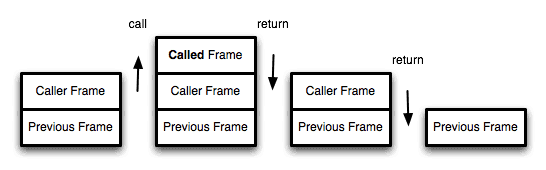

# 元编程

元编程：操作程序本身行为特性的编程
元编程关注以下几点：代码查看自身、代码修改自身、代码修改默认特性、影响其他代码

#### 元属性new.target
new.target总是访问真正new的目标的上下文
```js
class Parent {
    constructor() {
        if(new.target === parent) console.log('Parent instantiated');
        else console.log('Child instantiated');
    }
}
class Child extends Parent {}
var a = new Parent(); //Parent instantiated
var b = new Child(); //Child instantiated
```
#### 公开符号
symbol对外提供了一些公共的符号
`Symbol.iterator`
例如...、for...of都是自动使用Symbol.iterator的，它是对象上的一个专门属性，它会自动查找对象上有没有一个方法（可以构造一个迭代器来消耗这个对象的值）。你也可以重写：
```js
var arr = [1, 2, 3];
arr[Symbol.iterator] = function *() { ... }
```

`Symbol.toStringTag`和`Symbol.hasInstance`
```js
function Foo() {}
var a = new Foo();
a.toString(); //[object Object]
a instanceOf Foo; //true

//Symbol.toStringTag和Symbol.hasInstance更改上述结果
function Foo() {}
Foo.prototype[Symbol.toStringTag] = "Foo";
Object.defineProperty(Foo, Symbol.hasInstance, { value: obj => false }); 
//必须使用Object.defineProperty来使用Symbol.hasInstance，因为Function.prototype上的那个的writable是false
//obj就是FOO的实例，比如是a、b
var a = new Foo();
var b = new Foo();
b[Symbol.toStringTag] = "cool";
a.toString; //[object Foo];
b.toString; //[object cool];
a instanceof Foo; //false
b instanceof Foo; //false
```

`Symbol.toPrimitive`
```js
var arr = [1, 2, 3, 4, 5];
arr + 10; //1,2,3,4,510

arr[Symbol.toPrimitive] = function(hint) {
    //默认期望的运算类型，在这里是default，也是number
    //对于arr + 10来说，hint是default（number）
    //对于arr * 10来说，hint是number
    //对于String(arr)来说，hint是string
    if(hint == "default" || hint == "number") {
        return this.reduce(function(acc, curr) { return acc + curr }, 0);
    }
};
arr + 10; //25
```

`Symbol.isConcatSpreadable`
```js
var a = [1, 2, 3], b = [4, 5, 6];
[].concat(a, b); //[1, 2, 3, 4, 5, 6];
b[Symbol.isConcatSpreadable] = false;
[].concat(a, b); //[1, 2, 3, [4, 5, 6]]
```

#### 代理
代理是一种特殊的对象，它封装了一个普通的对象，作为该普通对象的拦截器。
```js
var obj = {a: 1};
var pobj = new Proxy(obj, {
    get: function(target, key, receiver) {
        console.log(target, key);
        return Reflect.get(target, key, receiver);
    }
});
//拦截obj的get方法做出一系列操作后通过Reflect.get转发该操作（在这里是到默认操作上）
obj.a; //1
pobj.a; //{a: 1} a
//1
```
每一个代理trap都有一个与之同名的Reflect api，在这里是get

```js
//列举Proxy可用trap
1.get：在代理上访问一个属性：Reflect.get(obj)、obj[]、obj.
2.set：在代理上设置一个属性：为对象赋值或解构等操作
3.deleteProperty：从代理对象上删除一个属性
4.Reflect.deleteProperty(obj)或delete obj
5.apply（如果目标是函数的话）：将代理作为普通函数调用
6.Reflect.apply、Reflect.call、func.apply、func.call
7.defineProperty
8.getPrototypeOf
9.setPrototypeOf
10.has
```
可取消的代理
```js
var obj = {a: 1};
var handlers = {
    get(target, key, receiver) {
        console.log("accessing: ", key);
        return target[key];
    }
};
//普通的代理是new Proxy()创建，而可取消代理只能这样创建
var {proxy: pobj, revoke: prevoke} = Proxy.revocable(obj, handlers);
pobj.a; //accessing: a
//1
prevoke();
pobj.a; //TypeError
//一旦代理被取消，所有对代理的操作均会TypeError
```

使用代理
日常中，建议实际操作的是代理，而元对象被隐藏起来
```js
//代理在先（首先与、主要或完全代理交互）
var message = [];
handlers = {
    get(target, key) {
        if(typeof target[key] === 'string') {
            //过滤掉标点符号
            return target[key].replace(/[^\w]/g, "");
        }
        return target[key];
    },
    set(target, key, val) {
        if(typeof val === "string") {
            val = val.toLowerCase();
            if(target.indexOf(val) === -1) target.push(val.toLowerCase())
        }
        return true;
    }
}

var message_proxy = new Proxy(messages, handlers);
message_proxy.push("hello...", 42, "wOrlD!!", "WoRlD!!");
//遍历message_proxy
//hello world
//遍历messages
//hello... world!!
```
```js
//代理在后（代码只能与主对象交互，实在不行了再与代理交互）
var handlers = {
    get(target, key, receiver) {
        return function() { receiver.speak(key + "!") }
    }
};
var catchall = new Proxy({}, handlers);//换成greeter结果也一样
var greeter = {speak(who) {console.log("hello", who)}};
Object.setPrototypeOf(greeter, catchall);
greeter.speak(); //hello undefined
greeter.speak("world"); //hello world
greeter.everyone(); //hello everyone!
//代理作为greeter的原型，用户直接与greeter交流，而greeter没有everyone方法，js会顺着原型链找到代理查看代理有没有这个属性，此时会触发代理的get
```
No such property or method 
```js
//有时候，我们期望只有属性存在的时候才对该属性进行操作
var obj = {a: 1, foo(){ console.log(this.a) }};
handlers = {
    get(target, key, receiver) {
        if(Reflect.has(target, key)) {
            return Reflect.get(target, key, receiver);
        }
        else {
            throw 'No such property/method';
        }
    },
    set(target, key, receiver) {
        if(Reflect.has(target, key)) {
            return Reflect.set(target, key, receiver);
        }
        else {
            throw 'No such property/method';
        }
    }
}
var pobj = new Proxy(obj, handlers);
pobj.a = 3;
pobj.foo(); //3
pobj.b = 4; //Error: no such property/method
pobj.bar(); //Error: no such property/method

//代理在后
var handlers = {
    get() { throw 'No such property/method'; }
    set() { throw 'No such property/method'; }
}
pobj = new Proxy({}, handlers);
Object.setProtytypeOf(obj, pobj);
pobj.a = 3;
pobj.foo(); //3
pobj.b = 4; //Error: no such property/method
pobj.bar(); //Error: no such property/method
```

代理[[proptotype]]链
```js
//[[prototype]]机制的原理就是[[Get]]运算，当对象自身没有某个属性时，[[Get]]会自动把这个运算转给[[prototype]]处理
//我们可以用代理做一个原型环
var handlers = {
    get(target, key, receiver) {
         if(Reflect.has(target, key)) {
            return Reflect.get(target, key, receiver);
        }
        //直接对象没有该属性，则访问我们自定义的原型
        else {
            return Reflect.get( target[Symbol("[[Prototype]]")], key, receiver );
        }
    }
}
var obj1 = new Proxy({
    name: 'obj-1',
    foo() { console.log('foo': this.name) }
}, handlers);
var obj2 = Object.assign(Object.create(obj1), {
    name: 'obj-2',
    bar() { console.log('bar: ', this.name); this.foo(); }
});
obj1[Symbol.for("[[Prototype]]")] = obj2;
//现在，obj2.prototype是obj1，而obj1的Symbol("[[Prototype]]")是obj2
//当obj1某个属性没有时，会代理到Symbol("[[Prototype]]")上，也就是obj2上
obj1.bar(); //bar: obj1 
//foo: obj1
//因为obj1有name，所以访问的是obj1的name

obj2.foo(); //foo: obj2
//因为obj12没有foo，通过Prototype访问obj1的foo
```

```js
//不用原型环，应用：为一个对象创建多个“Prototype”
var obj1 = {
    name: 'obj-1',
    foo() { console.log('obj1.foo: ', this.name) }
}
var obj2 = {
    name: 'obj-2',
    foo() { console.log('obj2.foo', this.name) },
    bar() { console.log('obj2.bar', this.name) }
}
var handlers = {
    get(target, key, receiver) {
        if(Reflect.has(target, key)) {
            return Reflect.get(target, key, receiver);
        }
        else {
            for(var p of target[Symbol.for("[[Prototype]]")]) {
                if(Reflect.has(p, key)) {
                    return Reflect.get(p, key, receiver)
                }
            }
        }
    }
}
var obj3 = new Proxy({
    name: 'obj-3',
    baz() {
        this.foo();
        this.bar();
    }
}, handlers)
obj3[Symbol.for("[[Prototype]]")] = [obj1, obj2]
obj3.baz(); //obj1.foo: obj-3
//obj2.bar: obj-3
```

#### Reflect API
设计初衷：
* 将Object对象的一些明显属于语言内部的方法（比如Object.defineProperty），放到Reflect对象上，未来所有操作内部api的事情全部交由Reflect来做，而不是Object.。
* 修改了某些Object方法的返回结果，让其变得更合理。

Reflect的api与Proxy的trap一一对应，参考Proxy的那些trap。
Reflect API的第一个参数永远是目标对象，如果它不是一个对象，则会报错。

属性排序
```js
//一般的，对象的属性列出顺序是依赖于定义顺序的
//而我们可以使用Reflect.ownKeys将列出顺序改为es6的[[OwnPropertyKeys]]算法列出的顺序
//Object.getOwnPropertyNames和Object.getOwnPropertySymbols也是按照该算法，只不过它们只能列出各自的
var o = {
    [Symbol("c")]: "yay",
    2: true,
    1: true,
    b: "awesome",
    a: "cool"
}
Reflect.ownKeys(o); //[1, 2, "b", "a", Symbol(c)]
Object.getOwnPropertyNames(o); //[1, 2, "b", "a"]
Object.getOwnPropertySymbols(o); //[Symbol(c)]

//JSON.stringify(obj)不会考虑obj的原型链，它只会stringify obj自身的属性并返回
```
#### 尾调用
尾调用的概念非常简单，一句话就能说清楚，就是指某个函数的最后一步是调用另一个函数。
```js
function f(x){
  return g(x);
}
//函数f的最后一步是调用函数g，这就叫尾调用。

//下面的都不是尾调用

// 情况一
//调用g后，将其赋值给y然后再返回y
function f(x){
  let y = g(x);
  return y;
}

// 情况二
//调用g后，将结果+1再返回
function f(x){
  return g(x) + 1;
}
```
尾调用不一定出现在函数尾部，只要是最后一步操作即可。
```js
function f(x) {
  if (x > 0) {
    return m(x)
  }
  return n(x);
}
//上面代码中，函数m和n都属于尾调用，因为它们都是函数f的最后一步操作。
```

尾调用之所以与其他调用不同，就在于它的特殊的调用位置。
我们知道，函数调用会在内存形成一个"调用记录"，又称"调用帧"（call frame），保存调用位置和内部变量等信息。如果在函数A的内部调用函数B，那么在A的调用记录上方，还会形成一个B的调用记录。等到B运行结束，将结果返回到A，B的调用记录才会消失。如果函数B内部还调用函数C，那就还有一个C的调用记录栈，以此类推。所有的调用记录，就形成一个["调用栈"](http://zh.wikipedia.org/wiki/%E8%B0%83%E7%94%A8%E6%A0%88)（call stack）。




尾调用由于是函数的最后一步操作，所以不需要保留外层函数的调用记录，因为调用位置、内部变量等信息都不会再用到了，只要直接用内层函数的调用记录，取代外层函数的调用记录就可以了。

尾调用具体请参考[阮一峰的尾调用](http://www.ruanyifeng.com/blog/2015/04/tail-call.html)


EventLoop具体请参考[阮一峰的EventLoop](http://www.ruanyifeng.com/blog/2014/10/event-loop.html)