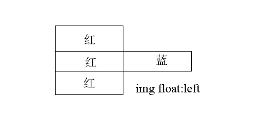
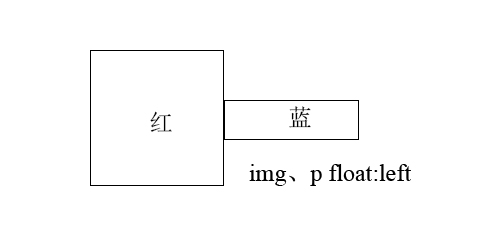
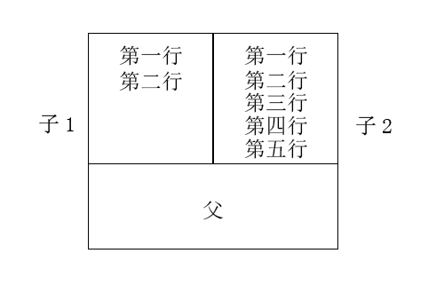
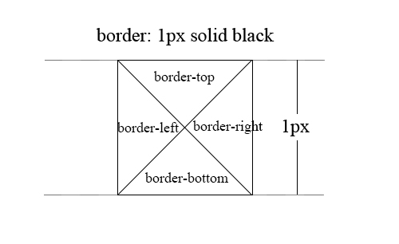

# 盒尺寸四大家族

### 深入理解content
#### content与替换元素
我们根据“外在盒子”是内联还是块级将元素分成内联元素和块级元素两种，也可以根据内容是否可替换将元素分为可替换元素和不可替换元素。`\<object>\<video>\<iframe>`等都是可替换元素。

> `src=""`即便是这样仍然有图片请求，它请求的是当前页面数据，当没有src属性时，图片便不会有任何请求。“在图片加载完成之前用占位图片代替直到加载完成”这一需求的最优方案是：
```css


img {
	display: inline-block;
	visibility: visible;
}
img[src] {
	visibility: hidden;
}
//在firefox中，img是inline，导致图片宽高设置无效，因此手动设置为inline-block
```

### padidng属性
#### padding与元素尺寸
```css
.box {
	width: 80px;
    padding: 20px 60px;
    box-sizing: border-box;
}
//设置了border-box，按理说最终宽度是80px，但由于120px的padding超出了范围，导致最终宽度是120px。因此，设置了border-box后，请保证你的border+padding+content小于等于width。
```

> 实现“登录 | 注册”效果（|的高度比文字要小）：
```css
<a>登录</a><a>注册</a>
a + a:before {
	content: "";
    font-size: 0;
    padding: 10px 3px 1px; (上10 右3 下1 左3)
    margin-left: 6px;
    border-left: 1px solid gray;
}
//如果不加font-size: 0，最终结果就是：“登录 | 注册”（|的高度是文字高度）。因为内联元素高度默认由font-size控制。
a + a:before {
	content: "";
    border-left: 1px solid gray;
}
//但是我们希望|的高度能够小一些，因此将font-size设置为0，用border控制高度。在padding为0时此时border在注册的左下方：“登录 . 注册”。padding-top使其向上延伸，padding-bottom使其向下延伸。
```

padding和margin百分比值无论是水平方向还是垂直方向都是相对于宽度计算的。

平时的网页很少只用`<button>`，而是用`<a>`来代替。但是，在表单中，有时候需要用到`<button>`自带的交互行为，因此可以这样：
```css
<button id="btn"></button>
<label for="btn">按钮</label>

button {
	position: absolute;
    clip: react(0 , 0, 0, 0); //隐藏之
}
label {
	display: inline-block;
    line-height: 20px;
    padding: 10px;
}
```

line-height就是文字加上空白加下空白的高度。可以理解为是一行文本的最终占用高度。

#### padding与图形绘制
```css
//绘制“三”
div {
	display: inline-block;
    width: 140px;
    height: 10px;
    padding: 35px 0;
    border-top: 10px solid;
    border-bototm: 10px solid;
    background-color: black;
    background-clip: content-box;
}
//绘制圆环（radio效果）
div {
	display: inline-block;
    width: 100px;
    height: 100px;
    padding: 10px;
    border: 10px solid;
    border-radius: 50%;
    background-color: black;
    background-clip: content-box;
}
//内心圆是width100和height100，中间空间的padding，外圆是border。bkc默认是连padding也填充为背景色，使用bkc-clip: content-box 将背景色设置为不填充padding。
```

### margin属性
#### margin与元素尺寸以及相关布局
```css
<div>
	
    <p>内容</p>
</div>

img {
	width: 100px;
    height: 100px;
    background-color: red;
}
p {
	background-color: blue;
}
```




从图中可以看出，流式盒子会盖住正常流盒子。

如何将最后一个元素的margin去掉？一般做法是：
```css
div {
	margin-right: 20px;
}
div:nth-child(最后一个元素索引) {
	margin-right: 0;
}
```

可以这样做，最简单高效，也不用去计算最后一个元素索引：
```css
.father {
	margin-right: -20px;
}
.child {
	margin-right: 20px;
}
```

只能使用子元素的margin-bottom来实现滚动容器的底部流白。滚动容器设置padding-bottom在有滚动条时会被忽略。


利用margin实现等高布局：
```css
.box {
	overflow: hidden; （!!!!!!）
    height: 500px;
}
.left, .right {
	width: 50%;
    float: left;
	margin-bottom: -9999px;
    padding-bottom: 9999px;
}
```


#### margin合并

margin合并：只发生在块级元素上，并且只发生在垂直方向上。

* 相邻兄弟之间的margin合并
* 父级和第一个/最后一个元素的margin合并，以下三种设置的最终效果是相同的：
```css
//1
.child { margin-top: 80px; }
//2
.father { margin-top: 80px; }
//3
.father, .child { margin-top: 80px; }
//这下你知道为什么给第一个子元素设置margin-top后，父元素却跟着向下移动的原因了吧。
```

如何阻止父子之间的margin合并？

对于margin-top合并：

* 父元素overflow: hidden
* 父元素设置border-top
* 父元素设置padding-top
* 父与第一个子之间添加一个内联元素

对于margin-bottom合并：

* 父元素overflow: hidden
* 父元素设置border-bottom
* 父元素设置padding-bottom
* 父与最后一个子之间添加一个内联元素
* 父元素设置height、min-height或max-height中的任意一个

以上设置满足一个即可。

margin合并的计算规则：正正取大值（10,20->20），正负相加（-10,20->10），负负最负值（-10,-20->-20）。

#### 深入理解margin: auto
margin: auto的填充规则如下：
* 一侧定值，一侧auto，则auto为剩余大小
* 两侧均auto，平分剩余空间
* 只有一侧auto，另一侧没有设置，则auto为剩余空间的全部

> 水平垂直居中
```css
//在absolute下，对侧均为0会导致容器自动填充至父级宽度（高度）
.son {
	position: absolute;
    left: 0;
    right: 0;
}
```

```css
.son {
	position: absolute;
    left: 0;
    right: 0;
    margin-left: 50px;
    margin-right: 50px;
}
//加了marginHorizontal后，内容宽度少了100px，多了水平方向100px的可填充空间，如果我们有width，就可以用marginHorizontal: auto来填充剩余空间。
```

```css
.son {
	position: absolute;
    left: 0;
    right: 0;
    top: 0;
    bottom: 0;
    margin: auto;
    width: 100px;
    height: 100px;
}
//首先四方向均为0为容器争取到了width和height均为100%的可填充空间，在设置width\height后，可填充空间就只剩下father-son了，再设置margin: auto让son的margin占据全部剩余空间，在视觉上就是水平垂直居中了。
```

#### margin合并的无效情况
一个普通元素，在默认流下，其定位方向是左侧以及上方，此时只有margin-left和margin-top可以影响元素定位。如果改变了定位方向，如`float: right`或者`absolute, right`定位，则margin-right可以影响元素定位。

### border属性
border-width不支持百分比。

border与三角：


```css
div {
	border: 10px solid;
    border-color: black transparent transparent;
}
//效果就是一个头向下的高度为5px的等腰直角三角形（border-top部分）
```
