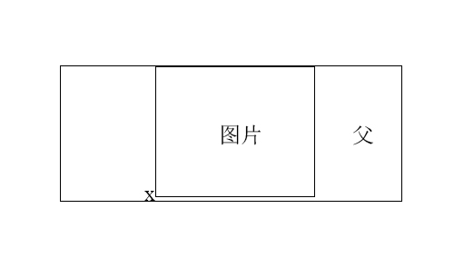

# 内部元素与流

### line-height
div\span\p\h等能够直接接收文字的标签，在默认情况下，他们的高度由line-height决定，而不是font-size。

关于`height=line-height`实现垂直居中的做法，其实只设置line-height就可以，height根本就没用。

> 多行文本垂直居中于父级
```css
<div class="father">
	<div class="child">多行文本</div>
</div>
.father {
	line-height: 120px; //必须是line-height不能是height
}
.child {
	display: inline-block; //必须
    line-height: 20px; //根据font-size适当调整
    vertical-align: middle
}
```

 --------------------------分割线-------------------------------
```html
<div class="father">
	<span class="child">内容</span>
</div>
```
无论内联元素line-height如何设置，最终父级的高度（如果没指定高度的话）都是由数值大的那个line-height决定。比如：`father-line-height=20px; child-line-height=60px;`，最终father高度为60px。这是因为span标签前面存在幽灵空白节点，它的高度由`father-line-height`决定。我们可以通过将child设为inline-block来去掉幽灵空白节点。

#### 使用line-height和vertical-align使图片垂直居中
```css
.father {
	width;
    height = line-height;
}
.father img {
	display: inline-block;
    vertical-align: middle
}

```

### vertical-align
line-height的百分比是相对于font-size计算的，vertical-align的百分比是相对于line-height计算的。vertical-align只能应用于inline、inline-block、inline-table和table-cell上。

水平垂直居中的：
```css
.father {
	height: 100px;
    width: 100px;
    display: table;
}
.middle {
	display: table-cell;
    vertical-align: middle;
}
.child {
	height: 50px;
    width: 50px;
    margin: 0 auto;
}
```
并不是child垂直居中了，而是middle垂直居中了，看似是child垂直居中于father了。

任意一个块级元素，如果里面有图片，该块级元素如果没有指定高度的话，那么块级元素高度基本上都会比图片高度高一点点。这是因为图片前面有幽灵空白节点，我们用x来代表它。


看到了吧，x导致了空隙的产生。我们可以：
* 图片设为inline-block
* 父元素line-height足够小，比如0
* 图片的vertical-align设为top、middle、bottom中的任意一个，只要不是默认的base-line就行。

> 基于vertical-align实现的水平垂直居中（多用于弹出框）：
```css
<div class="container">
	<div class="dialog">
    	<div class="content"></div>
    </div>
</div>

//全屏遮罩层
.container {
	position: fixed;
	top\right\left\bottom: 0;
    background-color: rgba(0 ,0 ,0, 0.5);
    text-align: center;
    font-size: 0;
    white-space: nowrap;
    overflow: auto;
}
.container:after {
	content: '';
    display: inline-block;
    height: 100%;
    vertical-align: middle;
}
//对话框
.dialog {
	display: inline-block;
    text-align: left;
    font-size: 14px;
    white-space-normal;
    background-color: white;
    padding: 20px;
}
//对话框内容
.content {
	width\height: 100px;
}
```