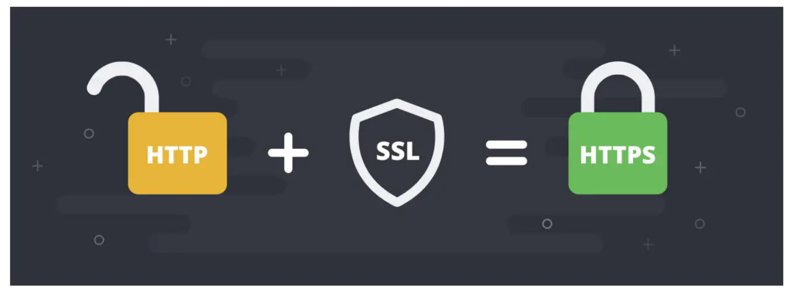
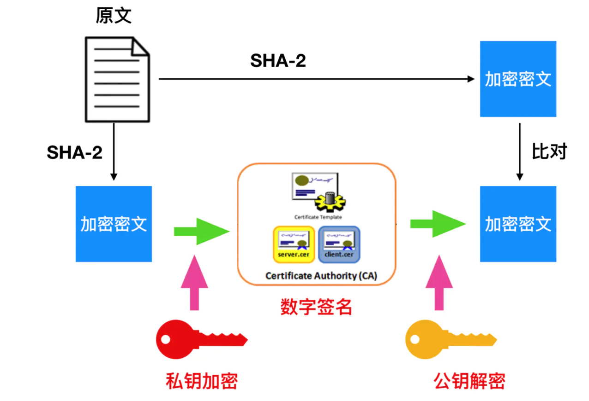

# Https

### HTTP 的问题

Http 是不安全的，在 HTTP 的传输过程中，任何人都有可能从中截获、修改或者伪造请求发送；在 HTTP 的传输过程中不会验证通信方的身份，因此 HTTP 信息交换的双方可能会遭到伪装，也就是没有用户验证；在 HTTP 的传输过程中，接收方和发送方并不会验证报文的完整性。

### Https

#### 定义

HTTPS 是一个在计算机世界里专门在两点之间安全的传输文字、图片、音频、视频等超文本数据的约定和规范。相当于在 HTTP 的基础上加了一个 Secure 安全的词眼。在 HTTPS 中，使用传输层安全性(TLS)或安全套接字层(SSL)对通信协议进行加密。也就是 HTTP + SSL(TLS) = HTTPS。

#### 指标

HTTPS 协议提供了三个关键的指标

* 加密(Encryption)， HTTPS 通过对数据加密来使其免受窃听者对数据的监听，这就意味着当用户在浏览网站时，没有人能够监听他和网站之间的信息交换，或者跟踪用户的活动，访问记录等，从而窃取用户信息。

* 数据一致性(Data integrity)，数据在传输的过程中不会被窃听者所修改，用户发送的数据会完整的传输到服务端，保证用户发的是什么，服务器接收的就是什么。

* 身份认证(Authentication)，是指确认对方的真实身份，也就是证明你是你（可以比作人脸识别），它可以防止中间人攻击并建立用户信任。

> 默认端口号443

#### SSL/TLS

TLS(Transport Layer Security) 是 SSL(Secure Socket Layer) 的后续版本，它们是用于在互联网两台计算机之间用于身份验证和加密的一种协议。

SSL/TLS 通过将称为 X.509 证书的数字文档将网站和公司的实体信息绑定到加密密钥来进行工作。每一个密钥对(key pairs) 都有一个 私有密钥(private key) 和 公有密钥(public key)，私有密钥是独有的，一般位于服务器上，用于解密由公共密钥加密过的信息；公有密钥是公有的，与服务器进行交互的每个人都可以持有公有密钥，用公钥加密的信息只能由私有密钥来解密。

TLS 在根本上使用对称加密和 非对称加密 两种形式。

#### 对称加密

对称加密(Symmetrical Encryption)顾名思义就是指加密和解密时使用的密钥都是同样的密钥。只要保证了密钥的安全性，那么整个通信过程也就是具有了机密性。如 AES。

#### 非对称加密

非对称加密(Asymmetrical Encryption) 也被称为公钥加密，相对于对称加密来说，非对称加密是一种新的改良加密方式。密钥通过网络传输交换，它能够确保及时密钥被拦截，也不会暴露数据信息。非对称加密中有两个密钥，一个是公钥，一个是私钥，公钥进行加密，私钥进行解密。公开密钥可供任何人使用，私钥只有你自己能够知道。如 RSA。

#### 混合加密

RSA 的运算速度非常慢，而 AES 的加密速度比较快，而 TLS 正是使用了这种混合加密方式。在通信刚开始的时候使用非对称算法，比如 RSA、ECDHE ，首先解决密钥交换的问题。然后用随机数产生对称算法使用的会话密钥（session key），再用公钥加密。对方拿到密文后用私钥解密，取出会话密钥。这样，双方就实现了对称密钥的安全交换。

#### 摘要算法

在 TLS 中，实现完整性的手段主要是摘要算法(Digest Algorithm)。MD5 的全称是 Message Digest Algorithm 5，它是属于密码哈希算法(cryptographic hash algorithm)的一种，MD5 可用于从任意长度的字符串创建 128 位字符串值。尽管 MD5 存在不安全因素，但是仍然沿用至今。MD5 最常用于验证文件的完整性。但是，它还用于其他安全协议和应用程序中，例如 SSH、SSL 和 IPSec。一些应用程序通过向明文加盐值或多次应用哈希函数来增强 MD5 算法。除了常用的 MD5 是加密算法外，SHA-1(Secure Hash Algorithm 1) 也是一种常用的加密算法，不过 SHA-1 也是不安全的加密算法，在 TLS 里面被禁止使用。目前 TLS 推荐使用的是 SHA-1 的后继者：SHA-2。

#### 认证

如何确定你自己的唯一性呢？我们在上面的叙述过程中出现过公钥加密，私钥解密的这个概念。提到的私钥只有你一个人所有，能够辨别唯一性，所以我们可以把顺序调换一下，变成私钥加密，公钥解密。使用私钥再加上摘要算法，就能够实现数字签名，从而实现认证。

#### CA

综合使用对称加密、非对称加密和摘要算法，已经实现了加密、数据认证、认证，这里还存在一个数字签名的认证问题。因为私钥是是自己的，公钥是谁都可以发布，所以必须发布经过认证的公钥，才能解决公钥的信任问题。

CA 的全称是 Certificate Authority，证书认证机构，你必须让 CA 颁布具有认证过的公钥，才能解决公钥的信任问题。