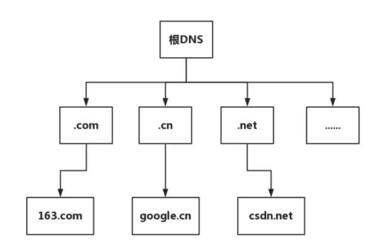
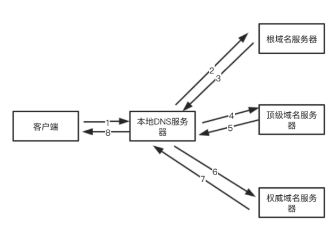
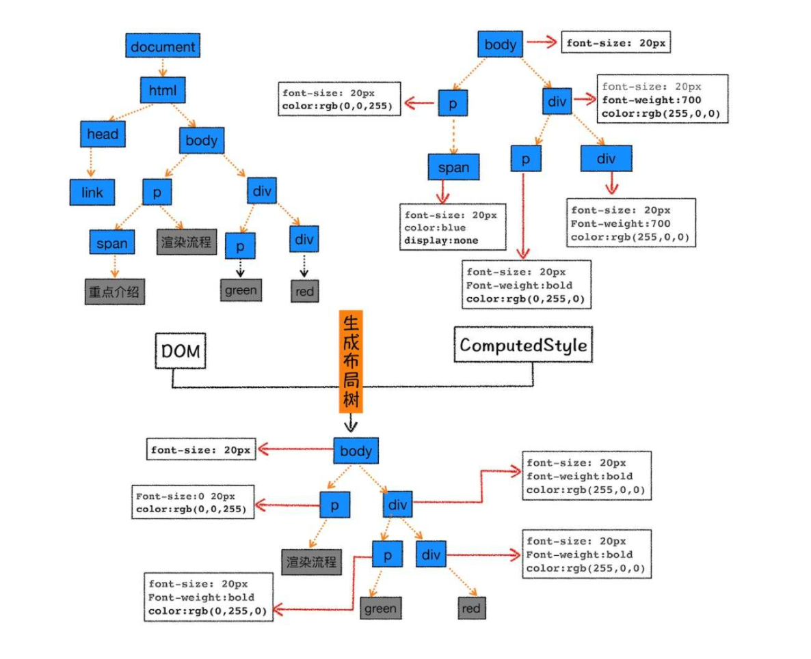
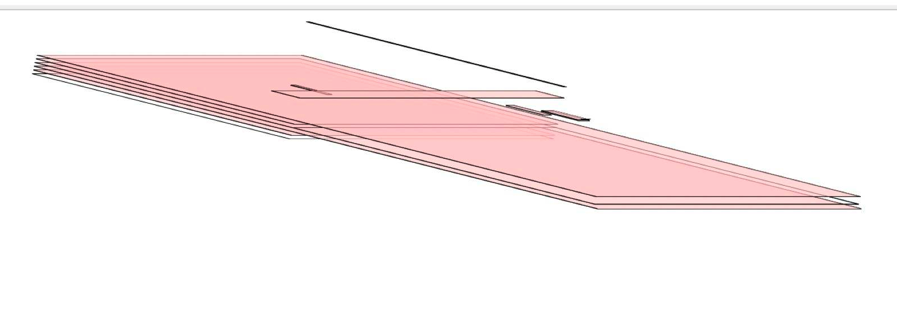
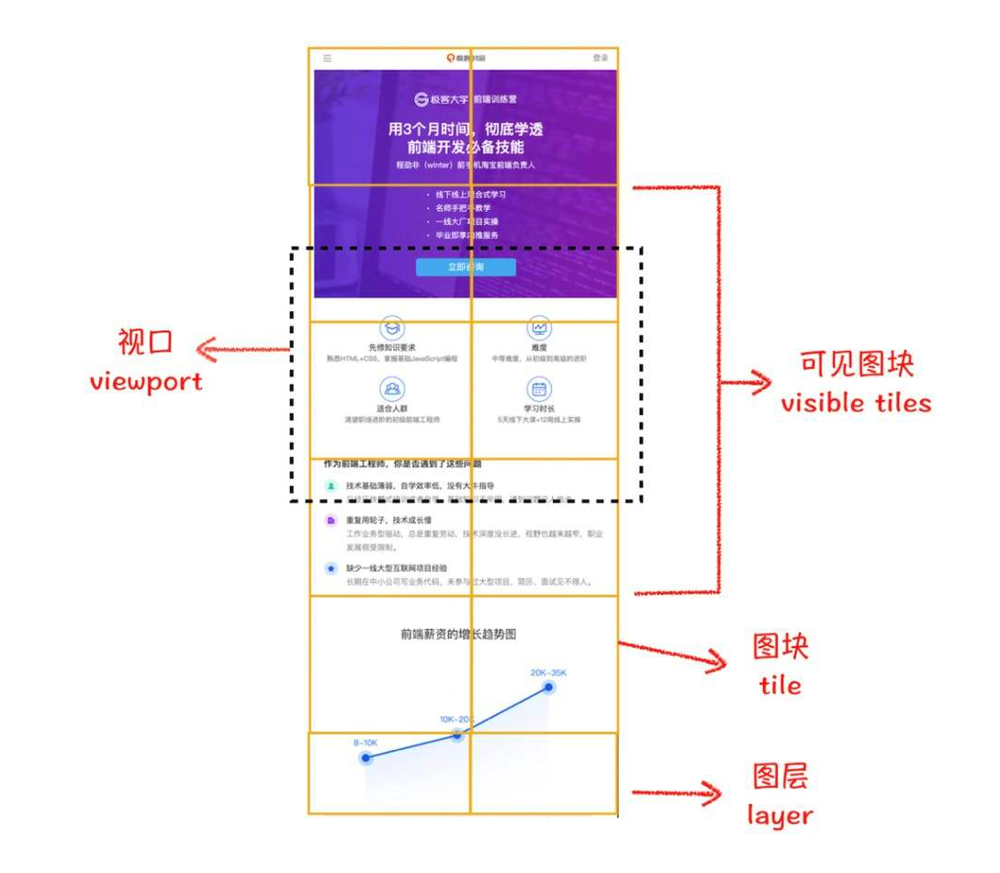

# 输入 URL 至页面呈现的过程

### 一、DNS 解析

数据包是以 IP 地址的形式传输的，因此在最开始通过 DNS 解析找到 URL 对应的 IP 地址。DNS 的域名查找，在客户端和浏览器，本地 DNS 之间的查询方式是递归查询；在本地 DNS 服务器与根域及其子域之间的查询方式是迭代查询。

#### DNS

DNS 服务器是树状结构，如图：

* 根 DNS 服务器：返回顶级域 DNS 服务器的 IP 地址
* 顶级域 DNS 服务器：返回权威 DNS 服务器的 IP 地址
* 权威 DNS 服务器：返回相应主机的 IP 地址

#### 递归查询

在客户端输入 URL 后，会有一个递归查找的过程，从浏览器缓存中查找->本地的hosts文件查找->找本地DNS解析器缓存查找->本地 DNS 服务器查找，这个过程中任何一步找到了都会结束查找流程。

#### 迭代查询

如果本地 DNS 服务器无法查询到，则根据本地 DNS 服务器设置的转发器进行查询。若未用转发模式，则迭代查找过程如下图：

### 二、建立 TCP 连接

#### 三次握手

待补充

#### HTTPS

需要建立 SSL 握手：

* 建立安全能力： 包括协议版本、会话 Id、密码构件、压缩方法和初始随机数
* 服务器发送证书：密钥交换数据和证书请求，最后发送请求-响应阶段的结束信号
* 如果有证书请求客户端发送此证书，之后客户端发送密钥交换数据，也可以发送证书验证消息
* 变更密码构件和结束握手协议

### 三、发送 HTTP 请求，服务器处理请求，返回响应结果

TCP 连接建立后，浏览器就可以利用 HTTP／HTTPS 协议向服务器发送请求。服务器接受到请求，就解析请求头，如果头部有缓存相关信息如 if-none-match 与 if-modified-since，则验证缓存是否有效，若有效则返回状态码为 304，若无效则重新返回资源，状态码为 200。

### 四、关闭 TCP 连接

#### 四次握手

待补充

### 五、浏览器渲染

整体流程如下图：

#### 资源加载

从上到下解析 html 文件，从本地或网络中加载所依赖的资源文件。每一个资源文件均是一轮新的建立连接、响应、传输、关闭连接步骤。当浏览器遇到 href 会并行下载资源并且不会停止对当前文档的处理。解析到 src ，会暂停其他资源的下载和处理，直到将该资源加载或执行完毕（这也是script标签为什么放在底部而不是头部的原因）。当 script 中有 defer 属性时，脚本的加载过程和文档加载是异步发生的，等到文档解析完（DOMContentLoaded 事件发生）脚本才开始执行；当 script 有 async 属性时，脚本的加载过程和文档加载也是异步发生的。但脚本下载完成后会停止 HTML 解析，执行脚本，脚本解析完继续HTML解析。

#### 构建 DOM 树

浏览器从网络或硬盘中获得 HTML 字节数据后会经过一个流程将字节解析为 DOM 树，先将 HTML 的原始字节数据转换为文件指定编码的字符，然后浏览器会根据HTML规范来将字符串转换成各种令牌标签，如 html、body 等。最终解析成一个树状的对象模型，就是 dom 树。

转码 -》token 化 -》构建 Nodes -》构建 DOM 树。

#### 样式计算

渲染引擎将 CSS 样式表转化为浏览器可以理解的 styleSheets，计算出 DOM 节点的样式。将所有值（px、em、rem、vw 等）转换为渲染引擎容易理解的、标准化的计算值，这个过程就是属性值标准化。处理完成后再处理样式的继承和层叠。

#### 页面布局

布局过程，即排除 script、meta 等功能化、非视觉节点，排除 display: none 的节点，计算元素的位置信息，确定元素的位置，构建一棵只包含可见元素布局树。如图：

这里牵扯到了重绘和重流，待补充

will-change: tranform ，让渲染引擎为其单独实现一个图层，当这些变换发生时，仅仅只是利用合成线程去处理这些变换，而不牵扯到主线程，大大提高渲染效率。当然这个变化不限于tranform, 任何可以实现合成效果的 CSS 属性都能用 will-change 来声明。

#### 生成分层树

页面中有很多复杂的效果，如一些复杂的 3D 变换、页面滚动，或者使用 z-indexing 做 z 轴排序等，为了更加方便地实现这些效果，渲染引擎还需要为特定的节点生成专用的图层，并生成一棵对应的图层树（LayerTree），如图：

分层树类似于 ps 中的图层，很好理解。

并不是布局树的每个节点都包含一个图层，如果一个节点没有对应的层，那么这个节点就从属于父节点的图层。拥有层叠上下文属性的元素会被提升为单独的一层（html、z-index 不为 auto 的绝对定位元素、position fixed、transform 不为 none、opacity 小于 1 等等）。

#### 栅格化

合成线程会按照视口附近的图块来优先生成位图，实际生成位图的操作是由栅格化来执行的。所谓栅格化，是指将图块转换为位图。如图：

通常一个页面可能很大，但是用户只能看到其中的一部分。因此，合成线程要做的事情就是将图层分块以加速页面的首屏展示。

渲染进程中专门维护了一个栅格化线程池，专门负责把图块转换为位图数据。然后合成线程会选择视口附近的图块，把它交给栅格化线程池生成位图。生成位图的过程实际上都会使用 GPU 进行加速，生成的位图最后发送给合成线程。

Chrome 采用了一个策略: 在首次合成图块时只采用一个低分辨率的图片，这样首屏展示的时候只是展示出低分辨率的图片，这个时候继续进行合成操作，当正常的图块内容绘制完毕后，会将当前低分辨率的图块内容替换。这也是 Chrome 底层优化首屏加载速度的一个手段。

### 显示

栅格化操作完成后，合成线程会生成一个绘制命令发送给浏览器进程。

浏览器进程根据这个命令把页面内容绘制到内存，生成页面，然后把这部分内存发送给显卡，由显卡将页面展现至浏览器上。

### 生命周期

#### DOMContentLoaded

DOM 树构建完毕，可以安全地访问 DOM 树所有 Node 节点、绑定事件等等。

#### Load

有资源都加载完毕，图片、背景、内容都已经完成渲染，页面处于可交互状态。
