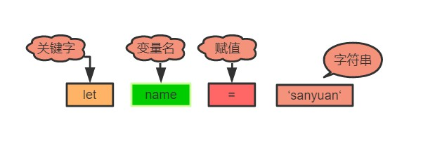
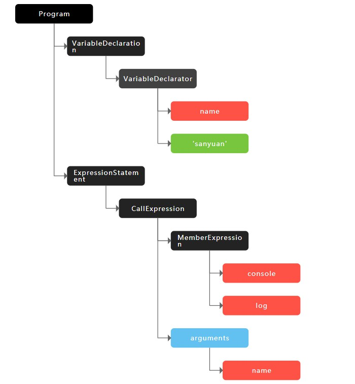

# V8 JS 执行过程

一段 JavaScript 代码放在 V8 当中究竟是如何执行的呢？

机器是读不懂 JS 代码，机器只能理解特定的机器码，那如果要让 JS 的逻辑在机器上运行起来，就必须将 JS 的代码翻译成机器码，然后让机器识别。JS属于解释型语言，对于解释型的语言说，解释器会对源代码做如下分析:

* 通过词法分析和语法分析生成 AST(抽象语法树)
* 生成字节码

然后解释器根据字节码来执行程序。

### 生成 AST

生成 AST 分为两步——词法分析和语法分析。

词法分析即分词，它的工作就是将一行行的代码分解成一个个token。 比如下面一行代码：

```js
let name = 'sanyuan'
```

其中会把句子分解成四个部分：



即解析成了四个token，这就是词法分析的作用。

接下来语法分析阶段，将生成的这些 token 数据，根据一定的语法规则转化为AST。举个例子：

```js
let name = 'sanyuan'
console.log(name)
```

最后生成的 AST 是这样的：



当生成了 AST 之后，编译器/解释器后续的工作都要依靠 AST 而不是源代码。顺便补充一句，babel 的工作原理就是将 ES5 的代码解析生成 `ES5 的 AST`，然后将 `ES5 的 AST` 转换为 `ES6 的 AST`,最后才将 `ES6 的 AST` 转化为具体的 `ES6` 代码。

回到 V8 本身，生成 AST 后，接下来会生成执行上下文。

### 生成字节码

开头就已经提到过了，生成 AST 之后，直接通过 V8 的解释器(也叫Ignition)来生成字节码。但是字节码并不能让机器直接运行，那你可能就会说了，不能执行还转成字节码干嘛，直接把 AST 转换成机器码不就得了，让机器直接执行。确实，在 V8 的早期是这么做的，但后来因为机器码的体积太大，引发了严重的内存占用问题。

给一张对比图让大家直观地感受以下三者代码量的差异：


很容易得出，字节码是比机器码轻量得多的代码。那 V8 为什么要使用字节码，字节码到底是个什么东西？

> 子节码是介于AST 和 机器码之间的一种代码，但是与特定类型的机器码无关，字节码需要通过解释器将其转换为机器码然后执行。

字节码仍然需要转换为机器码，但和原来不同的是，现在不用一次性将全部的字节码都转换成机器码，而是通过解释器来逐行执行字节码，省去了生成二进制文件的操作，这样就大大降低了内存的压力。

### 执行代码

接下来，就进入到字节码解释执行的阶段啦！

在执行字节码的过程中，如果发现某一部分代码重复出现，那么 V8 将它记做热点代码(HotSpot)，然后将这么代码编译成机器码保存起来，这个用来编译的工具就是V8的编译器(也叫做TurboFan) , 因此在这样的机制下，代码执行的时间越久，那么执行效率会越来越高，因为有越来越多的字节码被标记为热点代码，遇到它们时直接执行相应的机器码，不用再次将转换为机器码。

其实当你听到有人说 JS 就是一门解释器语言的时候，其实这个说法是有问题的。因为字节码不仅配合了解释器，而且还和编译器打交道，所以 JS 并不是完全的解释型语言。而编译器和解释器的根本区别在于前者会编译生成二进制文件但后者不会。

并且，这种字节码跟编译器和解释器结合的技术，我们称之为即时编译，也就是我们经常听到的JIT。

### 总结

这就是 V8 中执行一段JS代码的整个过程，梳理一下：

* 首先通过词法分析和语法分析生成 AST
* 将 AST 转换为字节码
* 由解释器逐行执行字节码，遇到热点代码启动编译器进行编译，生成对应的机器码，以优化执行效率
