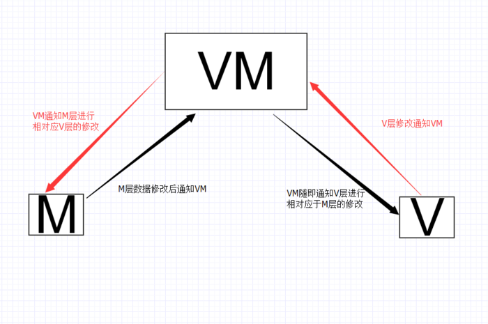

# Vue

#### mvvm


viewModel是整个vue实例

vue在编译阶段会识别出所有绑定在元素（通过 el 属性传入）上的指令。
link 过程中，建立这些指令与对应数据（通过 data 属性传入初始值）的watcher。watcher会在dep上添加订阅者，observe用来监听所有属性的变化，告知dep，由dep分发给每个watcher，再由watcher更新view。

双向绑定：数据劫持加收发订阅模式

数据劫持：defineProperty
```js
//数据劫持
function defineReactive (obj, key, val) {
	var dep = new Dep();
    Object.defineProperty(obj, key, {
    	get: function() {
         //添加订阅者watcher到主题对象Dep
         if(需要添加订阅者) {
         // JS的浏览器单线程特性，保证这个全局变量在同一时间内，只会有同一个监听器使用
         	dep.addSub(watcher);
         }
         return val;
       },
       set: function (newVal) {
       if(newVal === val) return;
       	val = newVal;
        console.log(val);
        // 作为发布者发出通知
        dep.notify();
       }
     })
}
//observe
function observe(this.data) {
 	Object.keys(obj).forEach(function(key) {
    	defineReactive(this.data, key, this.data[key]);
    })
}
//dep负责发送通知
function Dep() {
	this.subs = [];
}
Dep.prototype = {
	addSub: function(sub) {
    	this.subs.push(sub);
	},
   	notify: function() {
        this.subs.forEach(function(sub) {
          	sub.update();
        })
    }
}
```


#### vue-router钩子函数
```js
全局
router.beforeEach((to, from, next) //跳转前
router.afterEach //跳转后
组件内
beforeRouteEnter
beforeRouteUpdate (2.2 新增)
beforeRouteLeave
路由配置里
beforeEnter
```

指令：v-if、v-show、v-for、v-bind、v-on、v-model

自定义指令：
```js
Vue.directive(name, {
	//binding包括name\value\expression\arg等
	bind(el, binding, vnode) {指令第一次绑定到元素时}
    inserted(e, b, v) {被绑定元素插入父节点时调用}
    update(e, b, v) {所在组件的 VNode 更新时调用}
    等等
})

export default {
	name:'',
    directives: {
    	name: {
        	bind() {}
            xxx
        }
    }
}
```

组件通信
```js
父子
props传递
子组件$emit(name, args)，父级@name($event)

父级通过ref访问子组件实例

同级之间使用bus或者vuex
var bus = new Vue();
component1 bus.$emit('id-selected', 1)
component2 bus.$on('id-selected', id => {})
```