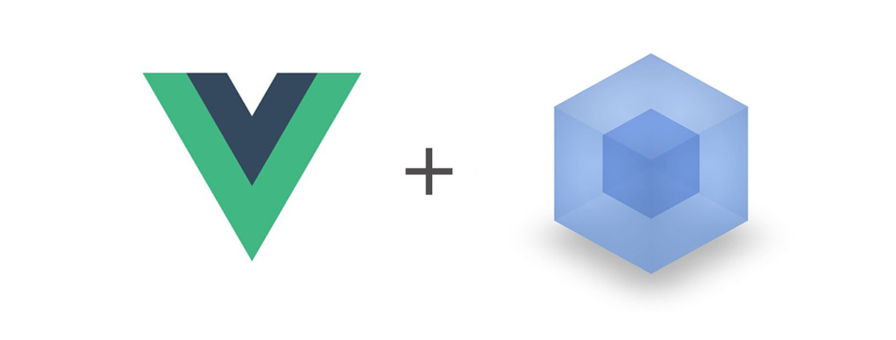

### 介绍
一个能够让你快速构建基于`vue`的`app`多页应用脚手架，可独立开发`h5 app`或集成到`hbuilder`开发原生应用。

#### 初衷

`hbuilder`提供了移动端开发方案，并不限制框架的选型，本质上还是基于`es5`的传统前端开发。模块化、对`es6`以及`.vue`文件的支持、预编译样式等均需要开发人员自己实现。

#### vue-cli
之所以不使用官方的`vue-cli`构建应用是因为：
* `vue-cli`需要自己实现多页面构建。
* 在开发环境（`npm start`）下会创建服务器，一切构建结果都存放在内存中，本地无法访问，导致`app`变为空白页。
* 只有在生产环境（`npm run build`）下才会构建到本地，却失去了对模块的实时监控。
* `webpack`拆分太细，功能太全，很多功能在`app`端都不会用到。

以上不足均可以自行修改`vue-cli`实现构建最优化，出于时间成本的考虑，最终决定在已有的`angular-m-cli`的基础上完成适合`app`开发的脚手架构建。

#### vue-app-cli
可以快速构建基于vue的app多页应用，对`h5页面app`和`dcloud原生app`都十分友好。

它实现了以下功能：
* 快速生成`app`模板
* 快速创建新页面
* 支持`es6`
* 支持`.vue`文件
* 基于`sass`编写样式文件
* 模块导入样式文件
* 错误映射